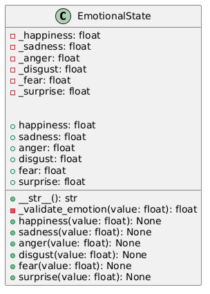
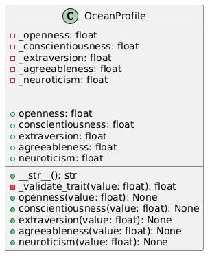
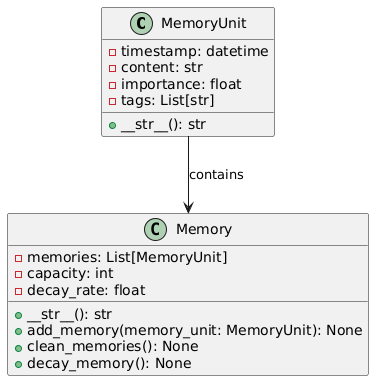
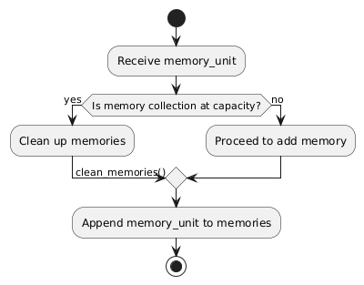
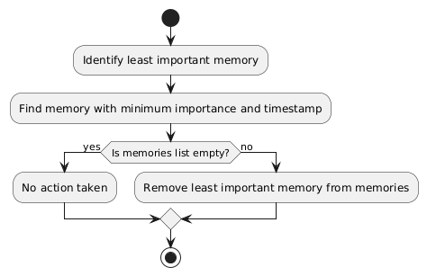
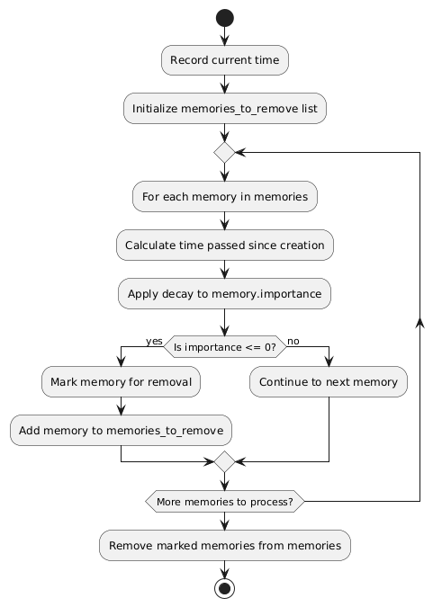
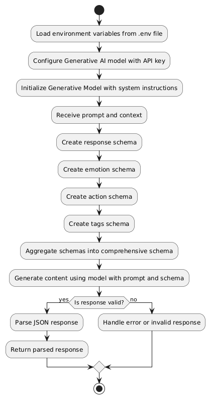
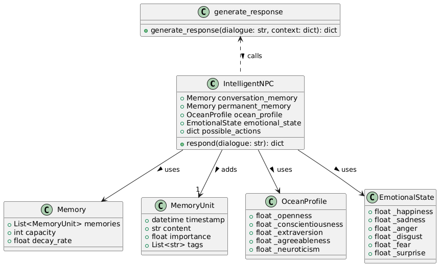

# ATHENA

Athena stands for "Artificially Tuned Human-
Emu

lating NPC Agent". It is library by which we can create intelligent NPCs.

## Work Done
1. Integrate Google GEMINI API to generate dialogues.
2. Add Personality and Emotion based on scientific studies.
3. Create basic Memory Unit for context awareness.

## Work being done
1. Creating a plugin for Unity and Godot.
2. Fine tune the memory and personality for more realistic generation.

## Architecture
### Emotion Class

### Personality Class

### Memory Class

#### Add memory

#### Clean memory

#### Decay memory

### Generate Dialogue

### NPC class
